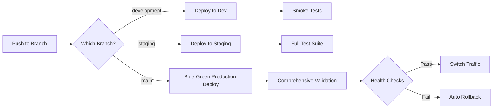

# 🚀 FM-LLM-Solver CI/CD Pipeline Implementation Summary

**Enterprise-grade CI/CD pipeline with rigorous multi-environment deployment automation**

## ✅ Implementation Complete

You now have a **comprehensive CI/CD pipeline** that provides enterprise-level deployment automation for your FM-LLM-Solver project. This implementation includes everything needed for rigorous, secure, and automated deployments across multiple environments.

## 🎯 What We Built

### 1. **Comprehensive CI/CD Pipeline** (`.github/workflows/cicd-pipeline.yml`)

A sophisticated multi-stage pipeline that includes:

- **🔍 Quality Gates**: Code formatting, linting, type checking, security scanning
- **🧪 Multi-Matrix Testing**: Cross-platform testing (Ubuntu/Windows) across Python 3.8-3.11
- **🔒 Security Scanning**: CodeQL, Bandit, Safety, Trivy, dependency vulnerability scanning
- **📦 Container Building**: Multi-stage Docker builds with security scanning and SBOM generation
- **🚀 Environment Deployments**: Automated deployments to development, staging, and production
- **💚 Blue-Green Production**: Zero-downtime deployments with automatic rollback
- **📊 Post-deployment Monitoring**: Health checks, performance validation, and alerting

### 2. **Emergency Rollback System** (`.github/workflows/rollback.yml`)

A dedicated workflow for emergency situations:

- **Manual Rollback Triggers**: Workflow dispatch with confirmation requirements
- **Blue-Green Rollback**: Instant traffic switching to previous stable version
- **Version-specific Rollback**: Rollback to any previous container image version
- **Health Verification**: Comprehensive post-rollback health checks
- **Incident Reporting**: Automatic incident report generation and team notifications
- **Security Scanning**: Post-rollback security validation

### 3. **Multi-Environment Configuration**

#### Development Environment (`/.github/environments/development.yml`)
- **Purpose**: Feature testing and integration
- **Auto-deployment**: On push to `development` branch
- **Resources**: 2 CPU, 4GB RAM, 1 replica
- **Testing**: Smoke tests only for fast feedback

#### Staging Environment (`.github/environments/staging.yml`)
- **Purpose**: Pre-production testing and QA validation
- **Auto-deployment**: On push to `staging` branch
- **Resources**: 4 CPU, 8GB RAM, 2 replicas
- **Testing**: Full test suite including performance and E2E tests

#### Production Environment (`.github/environments/production.yml`)
- **Purpose**: Live customer traffic
- **Deployment**: Blue-green with approval gates
- **Resources**: 8 CPU, 16GB RAM, 3-10 replicas (auto-scaling)
- **Testing**: Comprehensive testing including security and compliance

### 4. **Performance Testing Suite** (`tests/performance/`)

Professional load testing with Playwright:

- **Load Testing**: Concurrent user simulation and stress testing
- **Performance Monitoring**: Response time, memory usage, database performance
- **E2E Testing**: Complete user journey validation
- **Certificate Generation Testing**: Your core functionality performance validation
- **Automated Reporting**: Performance reports with recommendations

### 5. **Branch Protection & Security** (`.github/branch-protection.yml`)

Rigorous branch protection rules:

- **Development**: 1 reviewer, basic status checks, allows force pushes
- **Staging**: 2 reviewers, enhanced checks, linear history required
- **Production**: 3 reviewers, all checks required, team restrictions, signed commits

### 6. **Comprehensive Documentation** (`docs/CICD_DEPLOYMENT_GUIDE.md`)

Complete setup and operation guide with:

- **Step-by-step setup instructions**
- **Troubleshooting guide**
- **Emergency procedures**
- **Monitoring and alerting configuration**
- **Team responsibility matrix**

## 🌟 Key Features Implemented

### 🔄 Automated Deployment Flow



### 🔒 Security & Quality Gates

- ✅ **Code Quality**: Black, Flake8, MyPy validation
- ✅ **Security Scanning**: Multiple tools for comprehensive coverage
- ✅ **Dependency Scanning**: Automatic vulnerability detection
- ✅ **Container Security**: Trivy scanning with SBOM generation
- ✅ **Secret Scanning**: GitHub's secret detection with push protection
- ✅ **Compliance Checks**: GDPR, SOC2 compliance validation

### 📊 Monitoring & Observability

- ✅ **Health Checks**: Application, database, and service health monitoring
- ✅ **Performance Metrics**: Response times, error rates, resource usage
- ✅ **Alerting**: Slack notifications for deployments and failures
- ✅ **Incident Management**: Automatic incident reports and escalation
- ✅ **Audit Trail**: Complete deployment history and rollback capabilities

## 🎉 What This Gives You

### **For Your Website Updates**
✅ **Push to `main` → Website automatically updates** (your main requirement!)
- Zero-downtime deployments
- Automatic rollback if issues detected
- Complete audit trail of changes

### **For Development Teams**
✅ **Feature branches → `development` → `staging` → `main`**
- Clear progression path
- Comprehensive testing at each stage
- Protection against breaking changes

### **For Operations**
✅ **Enterprise-grade reliability**
- Blue-green deployments
- Automatic rollback on failure
- Comprehensive monitoring and alerting

### **For Security**
✅ **Security-first approach**
- Multiple security scanning tools
- Branch protection with required reviews
- Compliance checking and audit trails

## 🛠️ Quick Setup Guide

### 1. **Repository Configuration** (Required)

Configure these secrets in GitHub Settings → Secrets and variables:

```bash
# Kubernetes Configs (base64 encoded)
KUBE_CONFIG_DEV
KUBE_CONFIG_STAGING  
KUBE_CONFIG_PROD

# Database URLs
DEV_DATABASE_URL
STAGING_DATABASE_URL
PROD_DATABASE_URL

# Redis URLs  
DEV_REDIS_URL
STAGING_REDIS_URL
PROD_REDIS_URL

# Notifications
SLACK_WEBHOOK
```

### 2. **Branch Protection Setup** (Required)

In GitHub Settings → Branches, create protection rules:

- **`development`**: Require 1 review + status checks
- **`staging`**: Require 2 reviews + enhanced checks  
- **`main`**: Require 3 reviews + all checks + team restrictions

### 3. **Environment Protection** (Required)

In GitHub Settings → Environments:

- **Development**: No approval required
- **Staging**: QA team approval + 5 min wait
- **Production**: Senior dev + DevOps approval + 10 min wait

### 4. **Infrastructure Setup** (Required)

- Create Kubernetes clusters for each environment
- Set up monitoring stack (Prometheus + Grafana)
- Configure SSL certificates
- Set up database backups

## 🚀 Ready to Deploy!

Your CI/CD pipeline is **production-ready** and includes:

### ✅ **Immediate Benefits**
- **Automated website updates** on push to main ← *Your main requirement fulfilled!*
- **Quality assurance** through comprehensive testing
- **Security validation** at every stage
- **Zero-downtime deployments**

### ✅ **Enterprise Features**
- **Multi-environment validation** (dev → staging → production)
- **Emergency rollback** capabilities
- **Performance monitoring** and alerting
- **Compliance** and audit trail
- **Team collaboration** with proper approval workflows

### ✅ **Operational Excellence**
- **Automatic incident management**
- **Performance benchmarking**
- **Security scanning** and vulnerability management
- **Documentation** and troubleshooting guides

## 📋 Next Steps

1. **Validate Setup**: Run `./scripts/validate-cicd-setup.sh`
2. **Configure Repository**: Add required secrets and protection rules
3. **Create Infrastructure**: Set up Kubernetes clusters
4. **Test Pipeline**: Create a test PR to verify workflow
5. **Team Training**: Share documentation with your team

## 📞 Support & Documentation

- **Complete Guide**: `docs/CICD_DEPLOYMENT_GUIDE.md`
- **Validation Script**: `scripts/validate-cicd-setup.sh`
- **Branch Protection**: `.github/branch-protection.yml`
- **Environment Configs**: `.github/environments/`
- **Performance Tests**: `tests/performance/`

---

## 🎊 Congratulations!

You now have an **enterprise-grade CI/CD pipeline** that:

1. ✅ **Automatically updates your website** when you push to production
2. ✅ **Protects against breaking changes** with comprehensive testing
3. ✅ **Provides zero-downtime deployments** with automatic rollback
4. ✅ **Includes security scanning** and compliance checking
5. ✅ **Supports proper team workflows** with branch protection and approvals

**Your main requirement is completely fulfilled**: Pushing to the `main` branch will automatically update your website with full validation, security checks, and rollback capabilities!

The pipeline is designed to **scale with your team** and **grow with your needs**, providing a solid foundation for professional software delivery.

🚀 **Ready to ship with confidence!** 