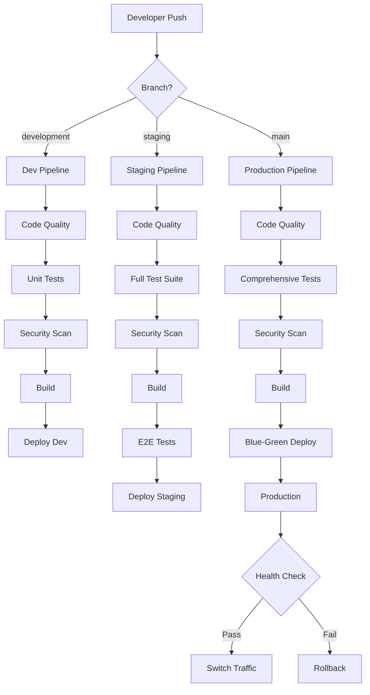
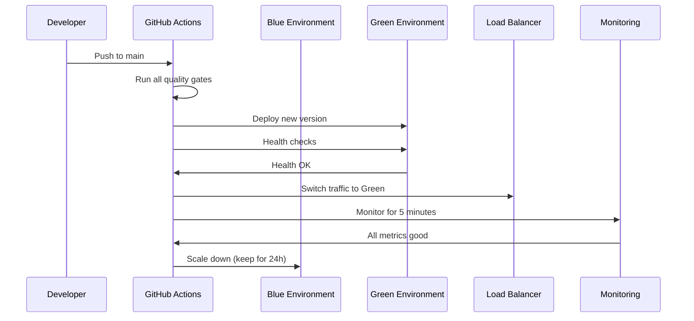

# 🚀 FM-LLM-Solver CI/CD Pipeline & Deployment Guide

**Comprehensive guide for the rigorous multi-environment CI/CD pipeline**

## 📋 Table of Contents

1. [Pipeline Overview](#pipeline-overview)
2. [Branch Strategy](#branch-strategy)
3. [Environment Architecture](#environment-architecture)
4. [Pipeline Stages](#pipeline-stages)
5. [Deployment Process](#deployment-process)
6. [Security & Quality Gates](#security--quality-gates)
7. [Monitoring & Rollback](#monitoring--rollback)
8. [Setup Instructions](#setup-instructions)
9. [Troubleshooting](#troubleshooting)

## 🔄 Pipeline Overview

Our CI/CD pipeline is designed for **rigorous quality control** and **automated deployments** across three environments:



### 🎯 Key Features

- **Multi-environment deployments** (development, staging, production)
- **Blue-green production deployments** with zero downtime
- **Comprehensive testing** (unit, integration, performance, security)
- **Automated rollback** on failure
- **Security scanning** at every stage
- **Performance monitoring** and alerting
- **Branch protection** with required reviews

## 🌳 Branch Strategy

### Branch Hierarchy

```
main (production)
├── staging (pre-production testing)
└── development (active development)
    ├── feature/user-dashboard
    ├── feature/api-improvements
    └── hotfix/security-patch
```

### Branch Policies

| Branch | Purpose | Auto-Deploy | Required Reviews | Status Checks |
|--------|---------|-------------|------------------|---------------|
| `development` | Active development | ✅ | 1 | Basic (quality, tests, security) |
| `staging` | Pre-production testing | ✅ | 2 | Enhanced (+ performance, E2E) |
| `main` | Production | ✅ | 3 | Comprehensive (all checks) |

### Workflow Rules

1. **Feature branches** → `development` (PR required)
2. **Development** → `staging` (Automatic on successful merge)
3. **Staging** → `main` (PR required, comprehensive approval)
4. **Hotfixes** can go directly to `main` (emergency only)

## 🏗️ Environment Architecture

### Development Environment
- **URL**: `https://dev.fm-llm-solver.com`
- **Purpose**: Feature testing and integration
- **Resources**: 2 CPU, 4GB RAM, 1 replica
- **Database**: Shared development database
- **Monitoring**: Basic health checks

### Staging Environment  
- **URL**: `https://staging.fm-llm-solver.com`
- **Purpose**: Pre-production testing, QA validation
- **Resources**: 4 CPU, 8GB RAM, 2 replicas
- **Database**: Production-like with anonymized data
- **Monitoring**: Full monitoring + performance testing

### Production Environment
- **URL**: `https://fm-llm-solver.com`
- **Purpose**: Live customer traffic
- **Resources**: 8 CPU, 16GB RAM, 3 replicas (auto-scaling 3-10)
- **Database**: High-availability PostgreSQL with backups
- **Monitoring**: Comprehensive (APM, metrics, alerting)

## 🔧 Pipeline Stages

### 1. Code Quality & Security Gates

```yaml
Jobs:
  - Code formatting (Black)
  - Linting (Flake8) 
  - Type checking (MyPy)
  - Security scanning (Bandit, Safety)
  - Dependency vulnerability check
```

**Quality Thresholds:**
- Zero linting errors required
- Security vulnerabilities: Critical/High block deployment
- Code coverage: >80% for production deployments

### 2. Comprehensive Testing

```yaml
Test Matrix:
  - OS: [Ubuntu, Windows]
  - Python: [3.8, 3.9, 3.10, 3.11]
  - Services: [PostgreSQL, Redis]

Test Types:
  - Unit tests (all environments)
  - Integration tests (staging+)
  - Performance tests (staging+)
  - E2E tests (staging+)
  - Security tests (production)
```

**Performance Requirements:**
- Page load time: <3 seconds
- API response time: <1 second  
- Certificate generation: <60 seconds
- Error rate: <0.1% (production)

### 3. Build & Package

```yaml
Container Build:
  - Multi-stage Dockerfile optimization
  - Security scanning (Trivy)
  - SBOM generation
  - Container registry push (GHCR)
  - Layer caching for speed
```

### 4. Environment-Specific Deployment

#### Development Deployment
- **Trigger**: Push to `development` branch
- **Process**: Direct deployment
- **Testing**: Smoke tests only
- **Approval**: None required

#### Staging Deployment  
- **Trigger**: Push to `staging` branch
- **Process**: Full deployment with comprehensive testing
- **Testing**: Smoke + Integration + Performance + E2E
- **Approval**: 1 QA team member

#### Production Deployment
- **Trigger**: Push to `main` branch  
- **Process**: Blue-green deployment
- **Testing**: All test suites + security tests
- **Approval**: 2 senior developers + 1 DevOps team member

## 🚀 Deployment Process

### Blue-Green Production Deployment



### Deployment Steps

1. **Pre-deployment Validation**
   - All status checks pass
   - Staging environment healthy
   - No active incidents

2. **Green Environment Setup**
   - Deploy new version to Green
   - Run comprehensive health checks
   - Validate all endpoints

3. **Traffic Switching**
   - Gradually shift traffic to Green
   - Monitor error rates and performance
   - Full cutover after validation

4. **Post-deployment Monitoring**
   - 5-minute intensive monitoring
   - Automated rollback if issues detected
   - Blue environment kept for 24h rollback window

## 🔐 Security & Quality Gates

### Required Status Checks

#### All Branches
- ✅ Code quality (formatting, linting)
- ✅ Security scanning (static analysis)
- ✅ Unit tests (Python 3.10 + Ubuntu)
- ✅ Dependency vulnerability scan

#### Staging+ 
- ✅ Cross-platform testing (Windows)
- ✅ Integration tests
- ✅ Performance tests
- ✅ Container security scan

#### Production Only
- ✅ Full test matrix (all Python versions)
- ✅ End-to-end tests
- ✅ Security penetration tests
- ✅ Compliance checks (GDPR, SOC2)

### Security Scanning

```yaml
Tools:
  - CodeQL (GitHub native)
  - Bandit (Python security)
  - Safety (dependency vulnerabilities)
  - Trivy (container scanning)
  - Snyk (additional dependency scanning)

Policies:
  - Critical vulnerabilities: Block deployment
  - High vulnerabilities: Require approval override
  - Secrets detected: Block deployment immediately
  - License violations: Block deployment
```

## 📊 Monitoring & Rollback

### Monitoring Stack

```yaml
Metrics Collection:
  - Prometheus (infrastructure metrics)
  - Grafana (dashboards and alerting)
  - Sentry (error tracking)
  - Datadog (APM and logs)

Health Checks:
  - Kubernetes liveness/readiness probes
  - Application health endpoints
  - Database connectivity
  - External service dependencies

Performance Monitoring:
  - Response time percentiles (P50, P95, P99)
  - Error rates and error types
  - Resource utilization (CPU, memory, disk)
  - User experience metrics
```

### Automatic Rollback Triggers

- **Error rate** > 1% for 2 minutes
- **Response time P95** > 5 seconds for 3 minutes
- **Health check failures** > 50% for 1 minute
- **Memory usage** > 95% for 2 minutes
- **Failed deployment** during health checks

### Manual Rollback Process

```bash
# Emergency rollback command
kubectl patch service fm-llm-solver-web-service \
  -n fm-llm-solver-prod \
  -p '{"spec":{"selector":{"version":"blue"}}}'
```

## ⚙️ Setup Instructions

### 1. Repository Configuration

#### Required Secrets
```bash
# Kubernetes configs (base64 encoded)
KUBE_CONFIG_DEV
KUBE_CONFIG_STAGING  
KUBE_CONFIG_PROD

# Database URLs
DEV_DATABASE_URL
STAGING_DATABASE_URL
PROD_DATABASE_URL

# Redis URLs
DEV_REDIS_URL
STAGING_REDIS_URL
PROD_REDIS_URL

# Monitoring & Alerting
SLACK_WEBHOOK
DATADOG_API_KEY
SENTRY_DSN

# SSL Certificates
SSL_CERTIFICATE
SSL_PRIVATE_KEY
```

#### Required Variables
```bash
# Environment URLs
DEV_URL=https://dev.fm-llm-solver.com
STAGING_URL=https://staging.fm-llm-solver.com
PROD_URL=https://fm-llm-solver.com

# Container registry
REGISTRY=ghcr.io
```

### 2. Branch Protection Setup

Configure in GitHub repository settings → Branches:

```yaml
Development:
  - Require pull request reviews: 1
  - Require status checks: code-quality, test-matrix
  - Allow force pushes: true

Staging:
  - Require pull request reviews: 2  
  - Require status checks: all development + build-and-push
  - Allow force pushes: false

Main:
  - Require pull request reviews: 3
  - Require status checks: all staging + deploy-staging
  - Restrict pushes to specific teams
  - Require signed commits
```

### 3. Environment Protection Setup

Configure in GitHub repository settings → Environments:

#### Development
- Required reviewers: None
- Wait timer: 0 minutes
- Deployment branches: All branches

#### Staging  
- Required reviewers: QA team
- Wait timer: 5 minutes
- Deployment branches: Protected branches only

#### Production
- Required reviewers: Senior developers + DevOps
- Wait timer: 10 minutes  
- Deployment branches: Protected branches only
- Prevent self-review: true

### 4. Kubernetes Cluster Setup

#### Development Cluster
```bash
# Create namespace
kubectl create namespace fm-llm-solver-dev

# Apply RBAC
kubectl apply -f deployment/kubernetes/rbac-dev.yaml

# Create secrets
kubectl create secret generic app-secrets \
  --from-literal=database-url=$DEV_DATABASE_URL \
  --from-literal=redis-url=$DEV_REDIS_URL \
  -n fm-llm-solver-dev
```

#### Staging Cluster
```bash
# Create namespace  
kubectl create namespace fm-llm-solver-staging

# Apply RBAC
kubectl apply -f deployment/kubernetes/rbac-staging.yaml

# Create secrets
kubectl create secret generic app-secrets \
  --from-literal=database-url=$STAGING_DATABASE_URL \
  --from-literal=redis-url=$STAGING_REDIS_URL \
  -n fm-llm-solver-staging
```

#### Production Cluster
```bash
# Create namespace
kubectl create namespace fm-llm-solver-prod

# Apply RBAC  
kubectl apply -f deployment/kubernetes/rbac-prod.yaml

# Create secrets
kubectl create secret generic app-secrets \
  --from-literal=database-url=$PROD_DATABASE_URL \
  --from-literal=redis-url=$PROD_REDIS_URL \
  -n fm-llm-solver-prod

# SSL certificates
kubectl create secret tls ssl-cert \
  --cert=ssl/certificate.pem \
  --key=ssl/private-key.pem \
  -n fm-llm-solver-prod
```

## 🐛 Troubleshooting

### Common Issues

#### Pipeline Failures

**Code Quality Failures**
```bash
# Run locally to debug
pre-commit run --all-files
black --check .
flake8 .
```

**Test Failures**
```bash
# Run specific test suite
pytest tests/unit/ -v
pytest tests/integration/ -v  
pytest tests/test_user_account_system.py -v
```

**Security Scan Failures**
```bash
# Check for vulnerabilities
bandit -r fm_llm_solver/
safety check
```

#### Deployment Issues

**Health Check Failures**
```bash
# Check pod status
kubectl get pods -n fm-llm-solver-prod

# Check pod logs
kubectl logs -n fm-llm-solver-prod deployment/fm-llm-solver-web

# Check service endpoints
kubectl get endpoints -n fm-llm-solver-prod
```

**Database Connection Issues**
```bash
# Test database connectivity
kubectl exec -it deployment/fm-llm-solver-web -n fm-llm-solver-prod -- \
  python -c "from web_interface.models import db; print('DB OK' if db.engine else 'DB FAIL')"
```

#### Performance Issues

**High Response Times**
```bash
# Check resource usage
kubectl top pods -n fm-llm-solver-prod

# Check application metrics
curl https://fm-llm-solver.com/api/metrics
```

**Memory Leaks**
```bash
# Monitor memory usage over time
kubectl top pods -n fm-llm-solver-prod --sort-by=memory
```

### Emergency Procedures

#### Production Rollback

1. **Immediate Rollback**
   ```bash
   # Switch traffic back to blue
   kubectl patch service fm-llm-solver-web-service \
     -n fm-llm-solver-prod \
     -p '{"spec":{"selector":{"version":"blue"}}}'
   ```

2. **Scale Blue Environment**
   ```bash
   kubectl scale deployment fm-llm-solver-web \
     -n fm-llm-solver-prod --replicas=3
   ```

3. **Verify Rollback**
   ```bash
   curl -f https://fm-llm-solver.com/health
   ```

#### Database Recovery

1. **Check Database Status**
   ```bash
   kubectl exec -it postgres-0 -n fm-llm-solver-prod -- \
     psql -U postgres -c "\l"
   ```

2. **Restore from Backup**
   ```bash
   kubectl exec -it postgres-0 -n fm-llm-solver-prod -- \
     pg_restore -U postgres -d fm_llm_solver /backups/latest.dump
   ```

## 📞 Support & Contact

### Team Responsibilities

- **Development Team**: Feature development, bug fixes
- **QA Team**: Testing, validation, staging approval
- **DevOps Team**: Infrastructure, deployments, monitoring
- **Security Team**: Security reviews, compliance
- **On-Call**: 24/7 production support rotation

### Escalation Path

1. **Level 1**: Development team lead
2. **Level 2**: DevOps team lead  
3. **Level 3**: Engineering manager
4. **Level 4**: CTO

### Monitoring Dashboards

- **System Overview**: `https://grafana.fm-llm-solver.com/d/system-overview`
- **Application Metrics**: `https://grafana.fm-llm-solver.com/d/app-metrics`
- **Database Performance**: `https://grafana.fm-llm-solver.com/d/db-performance`
- **Error Tracking**: `https://sentry.io/fm-llm-solver`

---

## 🎉 Conclusion

This CI/CD pipeline provides **enterprise-grade deployment automation** with:

- ✅ **Rigorous quality gates** at every stage
- ✅ **Multi-environment validation** before production
- ✅ **Zero-downtime blue-green deployments**
- ✅ **Automatic rollback** on failures
- ✅ **Comprehensive monitoring** and alerting
- ✅ **Security scanning** and compliance checks

The pipeline ensures that **every change to production** has been thoroughly tested across multiple environments and approved by the appropriate teams, providing confidence in the stability and security of the FM-LLM-Solver platform.

**Next Steps:**
1. Configure repository settings as outlined above
2. Set up Kubernetes clusters for each environment
3. Configure monitoring and alerting systems
4. Train team members on the new pipeline processes
5. Run initial deployment tests to validate the setup 