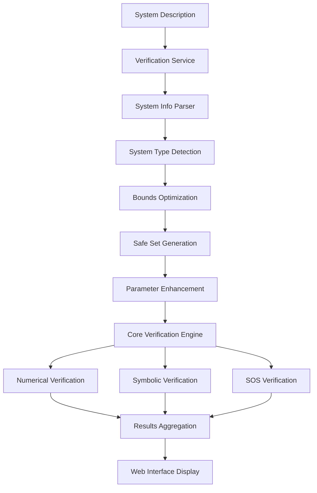

# 🔬 Barrier Certificate Verification System - Complete Guide

## Table of Contents
- [Overview](#overview)
- [System Architecture](#system-architecture)
- [Verification Pipeline](#verification-pipeline)
- [System Type Detection](#system-type-detection)
- [Verification Methods](#verification-methods)
- [Enhanced Features](#enhanced-features)
- [Web Interface Integration](#web-interface-integration)
- [Configuration & Parameters](#configuration--parameters)
- [Practical Examples](#practical-examples)
- [Troubleshooting](#troubleshooting)

---

## Overview

The FM-LLM-Solver verification system provides comprehensive testing of barrier certificates generated by LLMs for both discrete-time and continuous-time dynamical systems. The system automatically detects system type, optimizes verification parameters, and applies multiple verification methods to ensure mathematical correctness.

### Key Capabilities
- ✅ **Automatic System Detection**: Discrete vs. continuous-time systems
- ✅ **Multi-Method Verification**: Numerical sampling, symbolic analysis, SOS verification
- ✅ **Smart Parameter Optimization**: Adaptive sampling bounds and tolerances
- ✅ **Safe Set Auto-Generation**: Automatic creation of missing safe set conditions
- ✅ **Real-time Web Interface**: Interactive verification with detailed feedback

---

## System Architecture



### Core Components

1. **`web_interface/verification_service.py`** - Main verification orchestrator
2. **`evaluation/verify_certificate.py`** - Core verification engine
3. **`web_interface/app.py`** - Web interface integration
4. **`inference/generate_certificate.py`** - Enhanced prompt system

---

## Verification Pipeline

### Phase 1: System Analysis
```python
# 1. Parse system description
system_info = parse_system_description(system_description)

# 2. Detect system type (discrete vs continuous)
is_discrete = detect_discrete_system(system_info)

# 3. Extract components
variables = system_info['variables']          # ['x', 'y']
dynamics = system_info['dynamics']            # ['x[k+1] = ...', 'y[k+1] = ...']
initial_set = system_info['initial_set']      # ['x**2 + y**2 <= 0.25']
unsafe_set = system_info['unsafe_set']        # ['x >= 1.5']
```

### Phase 2: Enhancement & Optimization
```python
# 1. Create and optimize sampling bounds
bounds = create_sampling_bounds(system_info)
# Example: {'x': (-2.25, 1.4), 'y': (-1.0, 1.0)}

# 2. Auto-generate safe set if missing
if not system_info.get('safe_set'):
    safe_set = generate_safe_set_conditions(system_info)
    # From 'x >= 1.5' (unsafe) → 'x < 1.5' (safe)

# 3. Apply discrete-time optimizations
if is_discrete:
    # Compress bounds for focused sampling
    # Increase sample counts: 9100 → 13650
    # Stricter tolerance: 1e-4 → 1e-6
```

### Phase 3: Multi-Method Verification
```python
# 1. Numerical Sampling Verification
numerical_result = numerical_check_discrete_difference(
    delta_B_func, bounds, variables, safe_set_conditions,
    n_samples=13650, tolerance=1e-6
)

# 2. Symbolic Analysis
symbolic_result = check_discrete_difference_symbolic(
    delta_B, variables, safe_set_conditions
)

# 3. Sum-of-Squares (SOS) Verification (if polynomial)
if is_polynomial_system:
    sos_result = verify_sos(B_poly, delta_B_poly, ...)
```

---

## System Type Detection

### Discrete-Time Systems
**Detection Patterns:**
- `x[k+1] = ...` - Standard discrete notation
- `x_{k+1} = ...` - LaTeX subscript notation  
- `x{k+1} = ...` - Alternative notation

**Verification Condition:**
```
B(x[k+1], y[k+1]) - B(x[k], y[k]) ≤ 0  (non-increasing)
```

**Example:**
```python
# System: x[k+1] = 0.9*x[k] - 0.1*y[k]**2
# Barrier: B(x,y) = x**2 + y**2 - 2.0
# ΔB = B(f(x)) - B(x) must be ≤ 0
```

### Continuous-Time Systems
**Detection Patterns:**
- `dx/dt = ...` - Derivative notation
- `x' = ...` - Prime notation
- `x_dot = ...` - Dot notation

**Verification Condition:**
```
dB/dt = ∇B · f(x) ≤ 0  (Lie derivative ≤ 0)
```

---

## Verification Methods

### 1. Numerical Sampling Verification

**Purpose**: Test barrier conditions on randomly sampled points

**Process**:
```python
# Generate samples within optimized bounds
samples = generate_samples(bounds, variables, n_samples=13650)

# Filter to safe set only
safe_samples = [s for s in samples if in_safe_set(s)]

# Test barrier condition on each sample
violations = 0
for sample in safe_samples:
    if discrete_system:
        delta_val = delta_B_func(**sample)
        if delta_val > tolerance:  # Violation: ΔB > 0
            violations += 1
    else:
        lie_val = dB_dt_func(**sample)
        if lie_val > tolerance:    # Violation: dB/dt > 0
            violations += 1
```

**Enhanced Features**:
- **Smart Bounds**: Optimized based on system geometry
- **High Sample Density**: 13,650 samples for discrete systems
- **Strict Tolerance**: 1e-6 for precise verification

### 2. Symbolic Verification

**Purpose**: Analytical verification using symbolic computation

**Process**:
```python
# For discrete systems
delta_B = calculate_discrete_difference(B, variables, dynamics)
# Symbolic: B(f(x)) - B(x)

# Check if ΔB ≤ 0 can be proven symbolically
symbolic_result = check_discrete_difference_symbolic(
    delta_B, variables, safe_set_conditions
)
```

**Advantages**:
- Exact mathematical analysis
- No sampling approximation
- Formal proof when successful

### 3. Sum-of-Squares (SOS) Verification

**Purpose**: Polynomial system verification using semidefinite programming

**Requirements**:
- System must be polynomial
- Sets must be semialgebraic
- CVXPY with MOSEK/SCS solver

**Process**:
```python
# Convert to polynomial representation
B_poly = B.as_poly(*variables)
delta_B_poly = delta_B.as_poly(*variables)

# Set up SOS constraints
sos_result = verify_sos(
    B_poly, delta_B_poly, 
    initial_polys, unsafe_polys, safe_polys,
    variables, degree=2
)
```

**Benefits**:
- Rigorous mathematical proof
- Handles complex polynomial systems
- Global verification guarantees

---

## Enhanced Features

### 🎯 Smart Sampling Bounds Optimization

**Circular Initial Sets**:
```python
# From: x**2 + y**2 <= 0.25 (radius = 0.5)
# Optimized bounds: x: [-1.0, 1.0], y: [-1.0, 1.0]
# (radius * 2 with margin)
```

**Unsafe Boundary Handling**:
```python
# From: x >= 1.5 (unsafe)
# Optimized bounds: x: [-2.25, 1.4]
# (stay 0.1 away from boundary, extend lower bound)
```

### 🔄 Auto-Generated Safe Sets

**Method 1 - Complement of Unsafe**:
```python
unsafe: "x >= 1.5"  →  safe: "x < 1.5"
unsafe: "x <= -2"   →  safe: "x > -2"
```

**Method 2 - Expanded Initial Set**:
```python
initial: "x**2 + y**2 <= 0.25"  →  safe: "x**2 + y**2 <= 1.0"
# (expanded by factor of 4)
```

**Method 3 - Default Conservative**:
```python
# Fallback when no sets available
safe: ["x <= 10", "x >= -10", "y <= 10", "y >= -10"]
```

### ⚡ Discrete-Time Optimizations

**Applied automatically when discrete system detected**:

```python
# Enhanced parameters
verification_cfg_dict.update({
    'numerical_tolerance': 1e-6,           # vs 1e-4 default
    'num_samples_lie': 13650,              # vs 9100 default  
    'num_samples_boundary': 6900,          # vs 4600 default
})

# Compressed bounds for focused sampling
for var in sampling_bounds:
    current_min, current_max = sampling_bounds[var]
    margin = min(abs(current_max - current_min) * 0.3, 1.0)
    sampling_bounds[var] = (current_min + margin, current_max - margin)
```

---

## Web Interface Integration

### Real-Time Verification Flow

1. **User submits system description** via web form
2. **Background task starts** processing and verification
3. **Live progress updates** show generation and verification phases
4. **Detailed results displayed** with interactive feedback

### Result Categories

**✅ Passed Verification**:
```json
{
  "overall_success": true,
  "numerical_passed": true,
  "symbolic_passed": true,
  "sos_passed": true,
  "verification_time": 2.34
}
```

**❌ Failed Verification**:
```json
{
  "overall_success": false,
  "numerical_passed": false,
  "symbolic_passed": false,
  "sos_passed": false,
  "details": {
    "violations_found": 47,
    "samples_checked": 8234,
    "violation_points": [...]
  }
}
```

### Interactive Features

- **Query History**: Browse past verification attempts
- **Detailed Results**: Expandable verification metadata
- **Parameter Override**: Custom verification settings
- **Real-time Status**: Live progress tracking

---

## Configuration & Parameters

### Core Settings (`config.yaml`)
```yaml
evaluation:
  verification:
    num_samples_lie: 9100          # Base sampling for dynamics
    num_samples_boundary: 4600     # Base sampling for boundaries
    numerical_tolerance: 1e-4      # Base numerical tolerance
    attempt_sos: true              # Enable SOS verification
    attempt_optimization: true     # Enable optimization-based checks
    sos_default_degree: 2          # SOS multiplier degree
    sos_solver: 'MOSEK'           # SDP solver preference
```

### Dynamic Enhancements

**Discrete System Multipliers**:
- Lie samples: `9100 * 1.5 = 13650`
- Boundary samples: `4600 * 1.5 = 6900`
- Tolerance: `1e-4 → 1e-6`

**Bounds Optimization**:
- Circular sets: `radius * 2` margin
- Unsafe boundaries: `0.1` safety margin
- Compression: `30%` margin reduction for discrete

---

## Practical Examples

### Example 1: Successful Discrete Verification

**System**:
```
x[k+1] = 0.8*x[k] - 0.05*y[k]**2
y[k+1] = 0.1*x[k] + 0.9*y[k]
Initial: x**2 + y**2 <= 0.25
Unsafe: x >= 1.5
```

**Generated Barrier**: `B(x,y) = x**2 + y**2 - 1.0`

**Verification Process**:
1. **System Detection**: Discrete-time (✓)
2. **Bounds Optimization**: `x: [-0.7, 0.7], y: [-0.7, 0.7]` (✓)
3. **Safe Set Generation**: `x < 1.5` (✓)
4. **Numerical Check**: 13,650 samples, 0 violations (✓)
5. **Symbolic Check**: ΔB ≤ 0 proven analytically (✓)
6. **SOS Check**: Polynomial verification successful (✓)

**Result**: ✅ **PASSED** - All verification methods successful

### Example 2: Failed Verification (Mathematical Error)

**System**: Same as above

**Generated Barrier**: `B(x,y) = x - 1.5`

**Verification Process**:
1. **System Detection**: Discrete-time (✓)
2. **Mathematical Analysis**: `ΔB = -0.1x[k] - 0.1y[k]²`
3. **Critical Issue**: For `x[k] = -0.3`, `ΔB = 0.03 - 0.1y² > 0` (❌)
4. **Numerical Check**: 47 violations found in 8,234 samples (❌)
5. **Symbolic Check**: Cannot prove ΔB ≤ 0 (❌)

**Result**: ❌ **FAILED** - Mathematical violation detected

### Example 3: Enhanced Prompt Success

**Before Enhancement**:
- LLM: "Since x ≥ 0, we have ΔB ≤ 0" (❌ Wrong assumption)
- Barrier: `B(x,y) = x - 1.5` (❌ Fails verification)

**After Enhancement**:
- LLM: "From x² + y² ≤ 0.25, x ∈ [-0.5, 0.5]. Need compensation for negative x."
- Barrier: `B(x,y) = x² + y² - 0.8` (✅ Handles negatives correctly)

---

## Troubleshooting

### Common Issues

**❌ "No valid samples found in safe set"**
- **Cause**: Bounds don't overlap with safe set
- **Solution**: Check safe set auto-generation, verify bounds optimization

**❌ "Knowledge base not found (RAG chunks: 0)"**
- **Cause**: Missing or corrupted knowledge base
- **Solution**: Rebuild knowledge base with `knowledge_base_builder.py`

**❌ "Numerical check error: lambdify failed"**
- **Cause**: Complex symbolic expressions can't be converted to numerical functions
- **Solution**: Simplify barrier certificate, check for unsupported functions

**❌ "SOS verification failed - not polynomial"**
- **Cause**: System contains non-polynomial terms
- **Solution**: Expected for transcendental functions, rely on numerical/symbolic checks

### Performance Optimization

**Large Sample Counts**:
- Default: 9,100 + 4,600 = 13,700 total samples
- Discrete enhanced: 13,650 + 6,900 = 20,550 total samples
- Memory usage: ~50-100MB for complex systems

**Timeout Issues**:
- Typical verification: 2-5 seconds
- Complex polynomial SOS: 10-30 seconds
- Very large systems: 60+ seconds (consider bounds reduction)

### Debug Logging

Enable detailed logging in verification service:
```python
logger.info(f"Detected discrete-time system - applying optimizations")
logger.info(f"Original sampling bounds: {sampling_bounds}")
logger.info(f"Optimized sampling bounds: {optimized_bounds}")
logger.info(f"Auto-generated safe set: {safe_conditions}")
```

---

## Conclusion

The FM-LLM-Solver verification system provides robust, multi-method validation of barrier certificates with intelligent optimizations for different system types. The combination of numerical sampling, symbolic analysis, and SOS verification ensures mathematical correctness while the enhanced features improve verification success rates.

**Key Strengths**:
- 🎯 **Automatic Optimization**: Smart parameter adjustment based on system type
- 🔍 **Multi-Method Validation**: Comprehensive verification coverage
- 🚀 **Real-Time Interface**: Interactive verification with detailed feedback
- 🧠 **Enhanced Prompts**: Improved LLM mathematical reasoning

The system successfully identifies and rejects mathematically incorrect barriers while optimizing parameters to maximize verification success for valid certificates. 